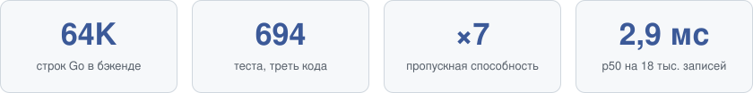

  

  <h1>
    Привет, я Артём
    
  </h1>

  

  

---

Backend-разработчик. Go и Python, PostgreSQL, Kubernetes, CI/CD.
Пишу сервисы полного цикла: код, тесты, контейнеры, деплой.

  &nbsp;
  &nbsp;
  &nbsp;
  &nbsp;
  &nbsp;
  &nbsp;
  &nbsp;
  &nbsp;
  &nbsp;
  

---

### Проекты

  

**100 вёрст** — B2B-платформа грузоперевозок, переписана с легаси PHP + MySQL на Go + PostgreSQL + React. Репозитории закрыты (коммерческий проект).

- Бэкенд на Go: модульный монолит, ~64 тыс. строк (треть из них — тесты: 694 теста), 98 эндпоинтов по OpenAPI-контракту, 34 миграции. Только chi, pgx и goose, остальное — стандартная библиотека.
- Деньги: неизменяемый леджер в копейках, холды, идемпотентность по ключу; гонки при зачислениях и возвратах покрыты тестами.
- Персональные данные шифруются на уровне приложения (AES-256-GCM + blind index для поиска), пароли — Argon2id, 2FA для администраторов.
- Собственный инструмент нагрузочного тестирования со сценариями с состоянием. Он нашёл Seq Scan в списке заявок; после индекса под порядок сортировки — 6 600 req/s вместо 950, p50 2,9 мс вместо 20 мс на 18 тыс. записей.
- Фронтенд: React + TypeScript, ~27 тыс. строк, типы API генерируются из OpenAPI, 208 тестов (Vitest, Playwright).

**[stalcraft-api-go](https://github.com/udkx/stalcraft-api-go)** — Go-клиент для STALCRAFT API: типизированные сервисы для всех эндпоинтов, три схемы авторизации с автообновлением OAuth-токена, клиент базы предметов. Без зависимостей вне стандартной библиотеки, 54 теста на `httptest`, CI с `-race` и golangci-lint.

**[minesweeper-ai](https://github.com/udkx/minesweeper-ai)** — сапёр и нейросеть с нуля на Python + PyTorch: движок, точный вероятностный решатель (перечисление конфигураций, сверка с полным перебором до 1e-9) и полносвёрточная сеть на 65 тыс. параметров. Сеть выигрывает 71,6 % партий на среднем уровне против 87,5 % у решателя, но впятеро быстрее, и выдаёт откалиброванные вероятности, хотя училась на жёстких метках. 25 тестов, CI.

**Проект Чернобыль** — открытый документальный архив о ликвидаторах аварии на ЧАЭС. Принцип: нет источника — нет утверждения. Next.js + Payload CMS, PostgreSQL. Репозиторий пока закрыт.

- Факт, событие хронологии или миф без ссылки на реестр источников не сохранится: это проверяет схема данных, а не интерфейс.
- Вики-режим с рецензированием: очередь предложенных правок, публикация только после одобрения, любая правка — новая неизменяемая версия, откат — тоже версия. Журнал аудита.
- Уровни доверия считаются из счётчиков одобренных, отклонённых и откатанных правок; «мелкая правка» определяется механически по изменённым полям.
- Архив источников: копия каждого из 68 документов с SHA-256 и снимком в Wayback Machine. 18 персональных страниц, схема меняется только миграциями, сквозной smoke-тест цикла «правка → одобрение → версия → откат».

**Архив особого хранения, фонд № 04** — интерактивная проза в форме найденного делопроизводства: вымышленное ведомство, опись дел, грифы, изъятые строки, кассетные расшифровки. Next.js 16, React 19, Drizzle + libSQL, Three.js. Репозиторий пока закрыт.

- Сюжет рассказывается формой документа: своя разметка (`[ИЗЪЯТО]`, `[ВОССТАНОВИТЬ]`, ссылки между делами), восстановление фрагментов сопоставлением с копией из другого дела, обратные ссылки вычисляются при чтении.
- Кабинет редактора: раздельные рабочий и опубликованный экземпляры дела, версия записи защищает от перезаписи из устаревшей вкладки (409 с сохранением текста), HMAC-подписанная сессия, проверка Origin на сервере.
- Приложения отдаются с поддержкой HTTP Range; файлы черновиков видит только редактор.
- Главный персонаж — процедурная 3D-модель на React Three Fiber: геометрия и текстуры генерируются кодом, без готовых ассетов.

**[sandustry-native](https://github.com/udkx/sandustry-native)** — нативное ядро симуляции на Rust, тик 9,9 мс против 21 мс в оригинале.

---

### Открытые проекты в цифрах

  

---

**Контакты** — Telegram [@udkx](https://t.me/udkx) · udkx@outlook.com
